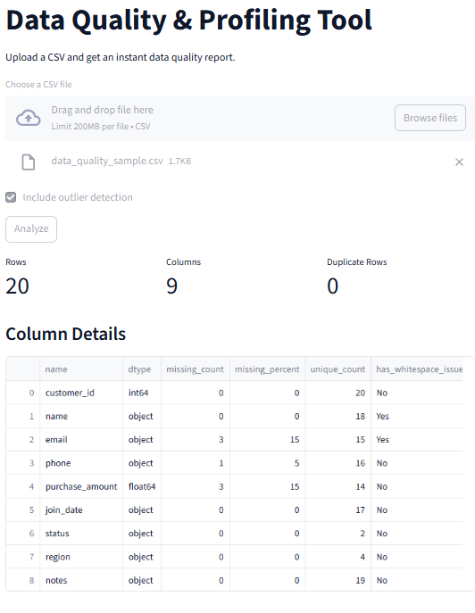

# 📊 Data Quality Profiler

> Upload your CSV datasets and get an instant, detailed data quality and profiling report — powered by a FastAPI backend and a Streamlit frontend.

Data Quality Profiler solves a critical data preparation problem: checking datasets for missing values, duplicates, outliers, and formatting issues (like untrimmed whitespaces or inconsistent casing) in a matter of seconds, without writing manual pandas profiling code.

---

## ✨ Key Features

- **CSV file profiling** — Instant summary statistics including row counts, column counts, and duplicate rows.
- **Column-level profiling** — Detailed breakdowns of each column's data type, missing value count, and unique value count.
- **Outlier detection** — Identifies numeric outliers using the Interquartile Range (IQR) method (can be toggled on/off).
- **Text anomaly detection** — Scans object/string columns for trailing/leading whitespaces and inconsistent capitalization (e.g. duplicate categories due to "Category" vs "category").
- **Secure API endpoints** — Secured FastAPI routes requiring API key authentication (`x-api-key` header).
- **Clean interactive UI** — Modern, responsive Streamlit dashboard featuring high-level metrics cards and an interactive column analysis table.
- **Input validation** — File format validation (only accepts non-empty CSV files) and robust error handling.

---

## 🛠️ Tech Stack

| Layer | Technology |
|-------|------------|
| Backend | Python, FastAPI |
| Web Server | Uvicorn |
| Frontend | Streamlit |
| Data analysis | Pandas |
| Authentication | API Key via Header (`x-api-key`) |
| Config management | Python-dotenv |

---

## 🚀 Run Locally

### Prerequisites

- Python 3.10+
- `pip`

### Steps

1. **Clone and enter the project**

   ```bash
   git clone https://github.com/rameelfaraz/code_journal.git
   cd code_journal/code_journal/fastapi/data_quality_profiler
   ```

2. **Create a virtual environment** *(recommended)*

   ```bash
   python -m venv venv
   ```

   Windows:
   ```bash
   venv\Scripts\activate
   ```

   macOS / Linux:
   ```bash
   source venv/bin/activate
   ```

3. **Install dependencies**

   ```bash
   pip install -r requirements.txt
   ```

4. **Configure Environment Variables**

   Copy `.env.example` to `.env`:

   Windows (PowerShell):
   ```powershell
   cp .env.example .env
   ```

   macOS / Linux:
   ```bash
   cp .env.example .env
   ```

   Open `.env` and set your preferred `API_KEY` (e.g., `supersecretkey`):
   ```env
   API_KEY=supersecretkey
   API_URL=http://localhost:8000/profile
   ```

5. **Start the FastAPI backend**

   ```bash
   uvicorn app.main:app --reload
   ```

6. **Start the Streamlit frontend** (in a separate terminal window, make sure to activate the virtual environment)

   ```bash
   streamlit run streamlit_app.py
   ```

7. **Open in browser**

   - Streamlit Frontend: `http://localhost:8501`
   - FastAPI Interactive API Docs: `http://127.0.0.1:8000/docs`

8. **Try a run** — Upload any CSV file (such as `transactions.csv` or `retail_sales.csv`) and click **Analyze**.

---

## 📁 Project Structure

```
data_quality_profiler/
├── .env                       # Local environment configuration (not committed)
├── .env.example               # Template for environment variables
├── .gitignore                 # Git ignore file for venv, cache, and .env
├── LICENSE                    # MIT License
├── README.md                  # This documentation
├── requirements.txt           # Project python dependencies
├── streamlit_app.py           # Streamlit frontend application
├── app/
│   ├── __init__.py            # App package initializer
│   └── main.py                # FastAPI endpoints, validation, & pandas profiling logic
└── screenshots/               # Directory for UI and demo screenshots
    └── dashboard.png
```

---

## ⚙️ How It Works

### Request flow

```
User (CSV Upload)  →  Streamlit App  →  FastAPI Endpoint  →  Pandas Analysis
         ↑                                                        |
         └───────────── Renders Metrics & Dataframe ←─────────────┘
```

1. User uploads a CSV file and hits **Analyze** in the Streamlit frontend.
2. The Streamlit app reads the CSV bytes and makes an asynchronous POST request to the `/profile` endpoint of the FastAPI backend.
3. The request includes the `x-api-key` in the headers for authentication.
4. FastAPI validates the API key, ensures the file is a valid non-empty CSV, and loads the data into a Pandas `DataFrame`.
5. The profiling logic checks:
   - High-level metrics: row count, column count, and duplicated rows.
   - Column metadata: data types and unique counts.
   - Missing data: null counts and null percentages.
   - Text issues: trailing/leading whitespaces and capitalization redundancy.
   - Outliers: Interquartile Range analysis (if enabled).
6. The backend returns a structured `ProfileReport` schema response.
7. Streamlit renders summary metrics cards and displays the profiling dataframe.

### Profiling logic details

- **Outlier Detection (IQR)**: Outliers are calculated on numeric columns using the Interquartile Range method. Values falling outside of $[Q1 - 1.5 \times IQR, Q3 + 1.5 \times IQR]$ are flagged and counted.
- **Whitespace & Casing Issues**: Text/string columns are scanned to see if any value has untrimmed whitespace (`str.strip()`), or if converting values to lowercase changes the number of unique entries, implying inconsistent casing capitalization across category values.

### Limitations

- **CSV Only**: Only CSV files are supported for profiling.
- **In-Memory Pandas**: Large datasets might cause out-of-memory errors on limited backend hosting plans, as files are fully read into RAM as Pandas DataFrames.
- **API Key Security**: The API key is sent via header. If the endpoint is exposed over HTTP instead of HTTPS, this key can be vulnerable to interception.
- **Single Session**: Uploaded analyses are transient. Refreshing the Streamlit dashboard clears the visual report (no persistence storage for reports is implemented).

---

## 📸 Screenshots

### Application Dashboard



---

## 📄 License

This project is licensed under the MIT License — see the [LICENSE](LICENSE) file for details.
