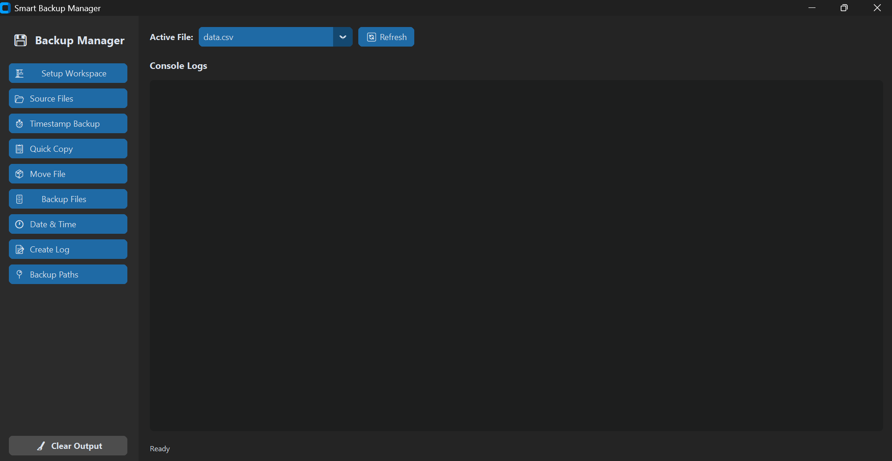
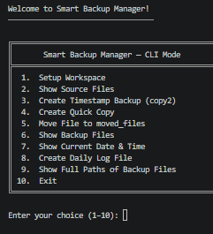

# Smart Backup Manager

A structured file backup and workspace utility that bridges the gap between terminal efficiency and modern desktop dashboards. It features both a command-line interface (CLI) and a sleek, dark-themed graphical user interface (GUI).

---

## The Problem It Solves

When working on active projects (like scripts, documents, or data sheets), files are frequently overwritten, deleted, or misplaced. Traditional version control systems like Git can feel too heavy or manual for quick local file rollbacks, while simple manual copying leads to unstructured, cluttered folders.

**Smart Backup Manager** solves this by:
* Creating a standardized local workspace structure automatically.
* Organizing backups, quick copies, log streams, and archives into dedicated directories.
* Preventing backup filename collisions with microsecond-based timestamps.
* Tracking every user action in auto-generated daily log files.
* Decoupling the operations engine so users can choose between terminal input or a GUI dashboard depending on their preference.

---

## How It Works

The project is structured under an MVC-like clean separation architecture:
1. **Core Logic Engine (`backup_core.py`):** Handles all absolute path calculations, filesystem operations (`shutil`, `os`), inputs verification (blocking path traversals and empty values), and logging. It does not print or take input directly; it returns standardized boolean flags and text messages to the caller.
2. **User Interfaces (`gui.py` and `cli.py`):** Consume the logic engine. They are thin, interchangeable presentation layers that handle user inputs and format status displays.
3. **Launcher Wrapper (`main.py`):** Inspects arguments to choose whether to spin up the CustomTkinter event loop or start the CLI loop.
4. **Local Workspace (`workspace/`):** A git-ignored workspace tree containing directories for active source files, backups, moved archives, and daily text log files.

---

## Key Features

* 🏗️ **Workspace Setup** — Creates a workspace structure (`source_files`, `backups`, `moved_files`, `logs`) containing sample starter files.
* ⏱️ **Timestamp Backups** — Saves timestamped backup copies of selected source files with auto-increment microsecond suffixes to prevent collisions.
* 📋 **Quick Copy** — Quickly clones files to the backup folder under a `copy_` prefix with optional duplicate overwrite confirmation prompts.
* 📦 **File Relocation** — Safely moves files from the active source area to the moved archives with warning popups.
* 📝 **Daily Logging** — Automatically records and appends logs tracking all actions to daily `log_YYYY-MM-DD.txt` files.
* 📍 **Path Resolution** — Prints full absolute file system paths of all created backups.
* 🎨 **Modern Interface** — A sleek CustomTkinter-powered dark theme interface alongside a fully featured command line companion.

---

## Detailed Functionality

* **Automatic Log Tracking:** Every action (such as setup, timestamp copies, quick copies, moves) appends a new entry to the logs showing the exact date, time, action type, and file paths involved.
* **Microsecond Collision Prevention:** If a backup is triggered repeatedly within the same second, the app appends the exact microsecond timestamp of execution to ensure files are never overwritten or skipped.
* **Path Traversal Blocker:** The core engine sanitizes filenames, blocking traversal attempts (e.g. `../` or absolute system files) from altering system areas outside of the project workspace.
* **Direct File Control:** An active dropdown menu in the GUI and interactive selection menu in the CLI show only current files in the source folder, avoiding typo-based errors.

---

## Project Limitations

While the Smart Backup Manager is perfect for local developer workspace organization, please keep the following operational constraints in mind:
* **Local Storage Only:** Backups are stored on your local disk inside the workspace folders. It does not support native cloud backups (AWS, Google Drive) or remote servers.
* **Flat File Structure:** Designed to backup files directly inside `workspace/source_files/`. It does not support recursive subdirectory searches or backing up nested folders.
* **Single Threaded GUI:** Backup and copy operations run on the main thread. While standard file transfers are instantaneous, copying extremely large files (several Gigabytes) may cause the GUI to temporarily freeze until copy completes.
* **No Version Diffing:** Copies the files as-is. It does not calculate line-by-line diffs or merge conflicts like Git.

---

## Step-by-Step Setup Guide

Follow these steps to clone, configure, and launch the manager on your local machine:

### 1. Clone the Repository
Open a terminal and run:
```bash
git clone https://github.com/YOUR_USERNAME/smart_backup_manager.git
cd smart_backup_manager
```

### 2. Install Dependencies
Install the graphical interface libraries from the requirements:
```bash
pip install -r requirements.txt
```

### 3. Run the Application
You can choose to launch either interface from the unified `main.py` entry point:

#### Option A: Run in Desktop GUI Mode (Default)
This opens the modern CustomTkinter dashboard panel:
```bash
python main.py
```

#### Option B: Run in Terminal CLI Mode
This launches the interactive keyboard-driven menus:
```bash
python main.py --cli
```

---

## Project Structure

```
smart_backup_manager/
├── main.py           # Launcher entry point (supports '--cli' switch)
├── backup_core.py    # Business logic and operations (fully decoupled)
├── cli.py            # Command line menus and user console interaction
├── gui.py            # CustomTkinter dark theme dashboard UI
├── requirements.txt  # Dependencies (customtkinter)
├── LICENSE           # MIT License
├── README.md         # Documentation and project manual
├── screenshots/      # Screenshots for documentation (gui.png, cli.png)
└── workspace/        # Local workspace directory (ignored by Git)
    ├── source_files/ # Files to be backed up
    ├── backups/      # Backup storage area
    ├── moved_files/  # Moved archive storage area
    └── logs/         # Daily action logs
```

---

## Screenshots

### Graphical User Interface (GUI)



---

### Command Line Interface (CLI)



---

## License

This project is licensed under the MIT License — see the [LICENSE](LICENSE) file for details.
