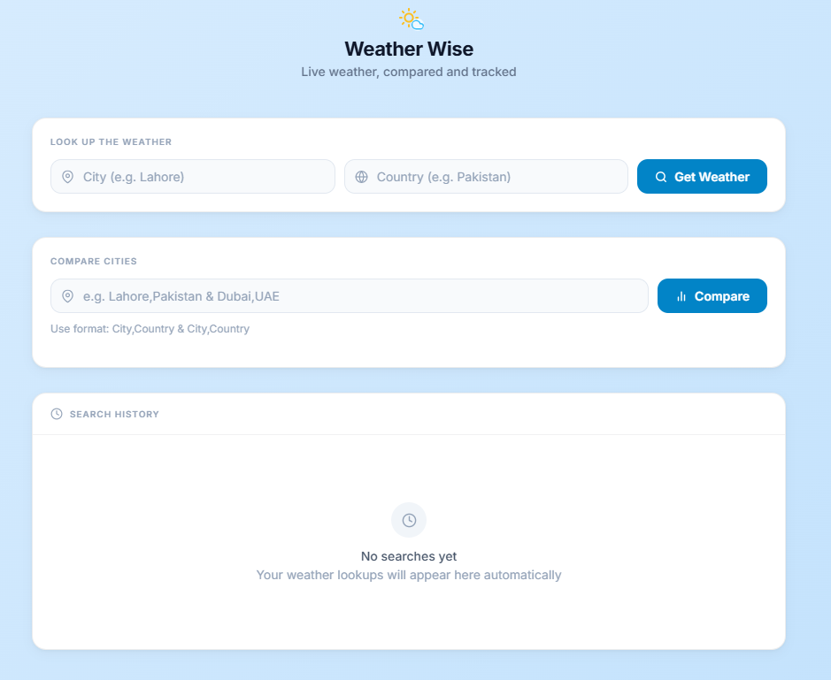
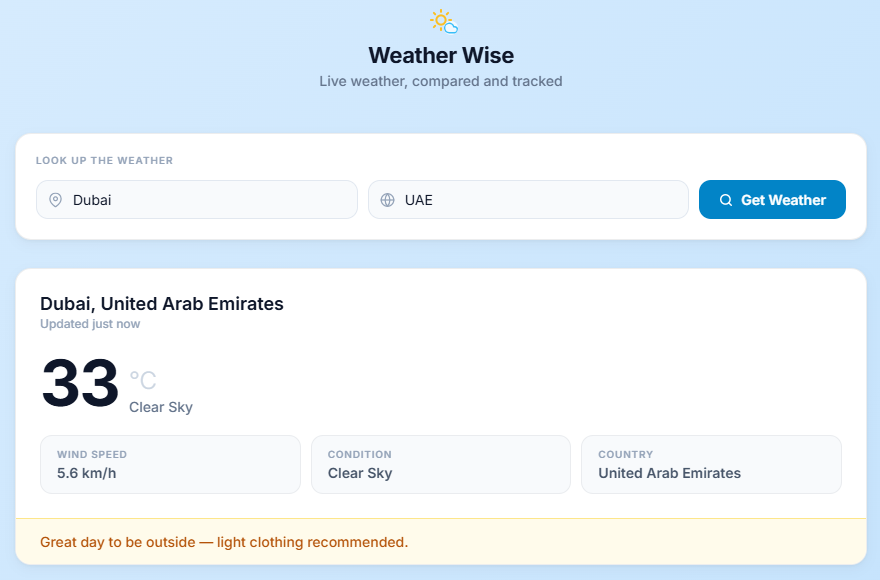
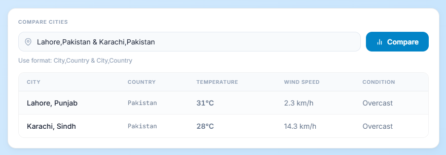
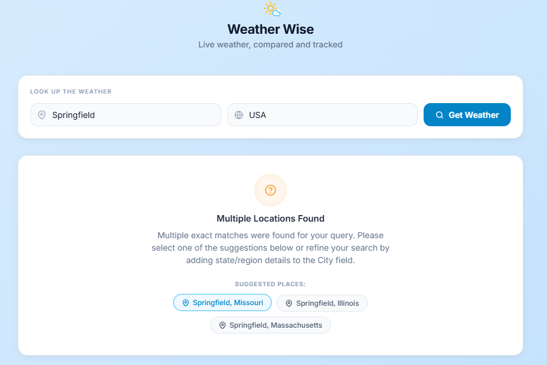
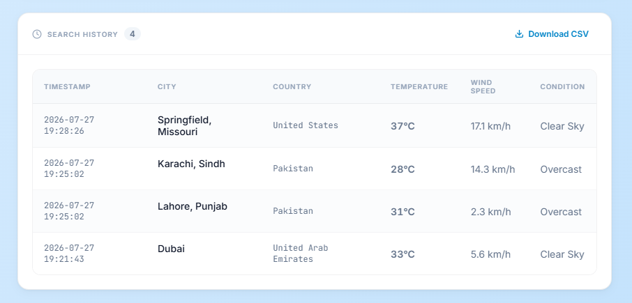
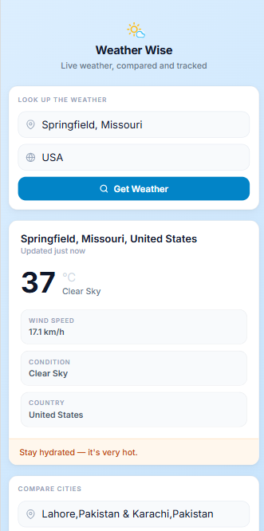

# 🌤️ Weather Wise

> Look up live weather by **city + country**, compare cities side-by-side, and track your searches — all in one clean web app.

Weather Wise solves a simple everyday problem: getting **accurate, location-specific weather** without opening multiple tabs or guessing which *Paris* or *Springfield* a generic search returned.

---

## 🔗 Live Demo

**[weather-wise-uf86.onrender.com](https://weather-wise-uf86.onrender.com)**

> Free-tier hosts sleep after inactivity — the first load may take 30–60 seconds.

---

## ✨ Key Features

- **City + country search** — Explicit location matching, not just city name alone
- **Country aliases** — Shortcuts like `USA`, `UK`, `PK`, `UAE`, and more
- **Ambiguity handling** — Suggests places when multiple matches exist; add state/region to narrow down
- **Compare cities** — Side-by-side table for up to 5 pairs: `City,Country & City,Country`
- **Smart tips** — Outfit and preparedness hints based on rain, heat, or cold
- **Session history** — Recent lookups in-app with a live count badge
- **CSV export** — Download your session as `weather_log.csv`
- **Responsive UI** — Works on desktop, tablet, and mobile
- **Input validation** — Client- and server-side checks for safe place names

---

## 🛠️ Tech Stack

| Layer | Technology |
|-------|------------|
| Backend | Python, Flask |
| HTTP client | `requests` → Open-Meteo geocoding + forecast |
| Frontend | HTML, CSS, vanilla JavaScript |
| Templates | Jinja2 (page shell + static asset URLs) |
| Data logging | CSV (`weather_log.csv` on server) |
| APIs | [Open-Meteo Geocoding](https://open-meteo.com/en/docs/geocoding-api) · [Open-Meteo Forecast](https://open-meteo.com/en/docs) |

---

## 🚀 Run Locally

### Prerequisites

- Python 3.10+
- `pip`

### Steps

1. **Clone and enter the project**

   ```bash
   git clone https://github.com/rameelfaraz/code_journal.git
   cd code_journal/python/weather_wise
   ```

2. **Create a virtual environment** *(recommended)*

   ```bash
   python -m venv venv
   ```

   Windows:
   ```bash
   venv\Scripts\activate
   ```

   macOS / Linux:
   ```bash
   source venv/bin/activate
   ```

3. **Install dependencies**

   ```bash
   pip install -r requirements.txt
   ```

4. **Start the app**

   ```bash
   python flask_app/app.py
   ```

5. **Open in browser**

   ```
   http://127.0.0.1:5000
   ```

6. **Try a search** — City: `Lahore`, Country: `Pakistan`

---

## 📁 Project Structure

```
weather_wise/
├── .gitignore                 # Ignores venv, bytecode, local weather_log.csv
├── LICENSE                    # MIT License
├── README.md
├── requirements.txt           # flask, requests
├── weather_core.py            # Geocoding, weather fetch, CSV logging, recommendations
├── flask_app/
│   ├── app.py                 # Flask routes, validation, /api/weather JSON endpoint
│   └── templates/
│       └── index.html         # HTML page shell (Jinja2 url_for for static assets)
├── static/
│   ├── css/
│   │   └── style.css          # Layout, cards, responsive styles, state UI
│   └── js/
│       └── app.js             # Search, compare, history, fetch API calls
└── screenshots/               # README demo images
    ├── home-desktop.png
    ├── result-success.png
    ├── compare-cities.png
    ├── ambiguity.png
    ├── history.png
    └── mobile-home.png
```

**Runtime file** (not committed): `weather_log.csv` — created when you run a search.

---

## ⚙️ How It Works

### Request flow

```
Browser  →  Flask (routes)  →  weather_core.py  →  Open-Meteo API
   ↑                                                    |
   └──────────── JSON response ←─────────────────────────┘
```

1. Browser loads `index.html` via `GET /`
2. CSS and JS served from `static/`
3. Search or compare triggers `GET /api/weather?city=...&country=...`
4. Flask validates input, then calls `fetch_weather_for_city()`
5. `weather_core.py` geocodes, fetches weather, logs to CSV, returns JSON
6. JavaScript renders results without a full page reload
7. Successful lookups added to session history and can be downloaded as CSV

### Geocoding logic

- City and country normalized and matched against Open-Meteo results
- Country aliases (`pk` → Pakistan, `usa` → United States, etc.)
- US state hints (`Springfield, IL`) disambiguate cities
- Multiple exact matches return suggestions instead of guessing

### Limitations

- **No API key** — Free Open-Meteo endpoints; subject to availability and rate limits
- **Current weather only** — No hourly or multi-day forecast in the UI
- **Session history** — Refreshing clears the in-app table (server CSV still logs each lookup)
- **Exact-match geocoding** — Typos may fail; ambiguous names need refinement
- **Compare cap** — Max 5 city pairs per request
- **No accounts** — No cross-device saved history
- **Free hosting** — App may sleep when idle on Render free tier

---

## 📸 Screenshots

### Home — desktop layout



### Weather result



### Compare cities



### Ambiguous locations



### Search history and CSV



### Mobile view



---

## 📄 License

This project is licensed under the MIT License — see the [LICENSE](LICENSE) file for details.
