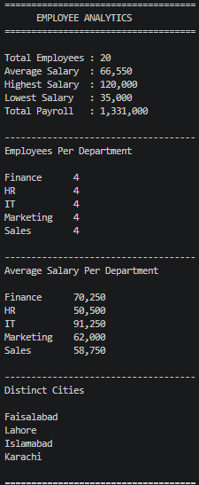

# Employee Analytics Dashboard (CLI)

A command-line tool built with Python and PostgreSQL that connects to
an employee database and generates real-time salary and department
analytics — including totals, averages, department breakdowns, city
distributions, and an interactive menu to explore the data.

This project was built as a hands-on way to practice SQL aggregate
functions and grouping, alongside connecting Python to a real
PostgreSQL database.

---

## 📁 Project Structure
employee_analytics/

├── README.md
\
├── schema.sql
\
├── sample_data.sql
\
├── analytics.py
\
├── config.example.py
\
├── requirements.txt
\
└── .gitignore

---

## 🗄️ Database

**Database name:** `employee_analytics`
**Managed with:** pgAdmin (PostgreSQL GUI)

### Table: `employees`

| Column      | Type    | Description                     |
|-------------|---------|----------------------------------|
| id          | SERIAL  | Primary key, auto-incrementing  |
| name        | TEXT    | Employee's full name            |
| department  | TEXT    | Department (IT, HR, Finance, Marketing, Sales) |
| salary      | NUMERIC | Monthly salary                  |
| city        | TEXT    | City the employee is based in   |

The table is seeded with 20 sample employees spread across 5
departments and 4 cities (Lahore, Karachi, Islamabad, Faisalabad).

---

## 🛠️ Technologies Used

- **Python 3** — application logic
- **PostgreSQL** — relational database
- **pgAdmin** — used to create the database and run schema/data scripts
- **psycopg (v3)** — Python driver used to connect to PostgreSQL

---

## ✨ Features

- Full formatted analytics dashboard (single command)
- Interactive CLI menu to run individual queries on demand
- Department-level breakdowns (employee count, average salary)
- City-level breakdowns and distinct city listing
- Salary statistics: total, average, highest, lowest
- Database credentials kept out of version control

---

## ⚙️ How It Works

1. `schema.sql` defines the `employees` table structure.
2. `sample_data.sql` inserts 20 sample employee records.
3. `analytics.py` connects to the database using `psycopg` and runs a
   set of SQL queries, printing the results either as a full
   dashboard or through an interactive menu.
4. Database credentials are stored in a local `config.py` file, which
   is excluded from Git via `.gitignore` — only `config.example.py`
   (a template with no real password) is committed.

---

## 🚀 How to Run

### 1. Set up the database (via pgAdmin)
- Open pgAdmin and create a new database named `employee_analytics`.
- Open the **Query Tool** on that database and run the contents of
  `schema.sql`, then `sample_data.sql`.

### 2. Set up your local credentials
- Copy `config.example.py` to a new file called `config.py`.
- Open `config.py` and replace the placeholder with your actual
  PostgreSQL password:
```python
DB_PASSWORD = "your_actual_password_here"
```

### 3. Set up the Python environment
```bash
python -m venv venv
source venv/Scripts/activate    # Git Bash on Windows
pip install -r requirements.txt
```

### 4. Run the program
```bash
python analytics.py
```

You'll see an interactive menu — choose an option (1–8) to run a
specific query, or option 7 to print the full dashboard.

---

## 📸 Sample Output

## Dashboard




---

## 🎓 What I Learned

- How to connect a Python application to a PostgreSQL database using
  `psycopg` (v3).
- Writing and combining SQL aggregate functions (`COUNT`, `SUM`,
  `AVG`, `MAX`, `MIN`) with `GROUP BY` and `HAVING`.
- Structuring a small CLI application around reusable query functions.
- Managing a PostgreSQL database visually through pgAdmin instead of
  the command line.
- Keeping sensitive credentials (like database passwords) out of
  version control using a gitignored config file.

---